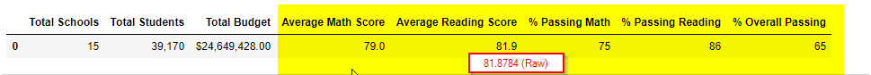
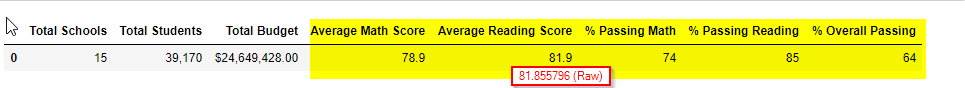
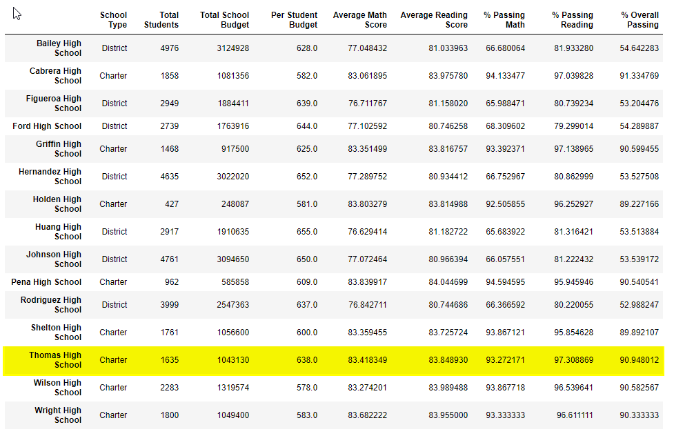
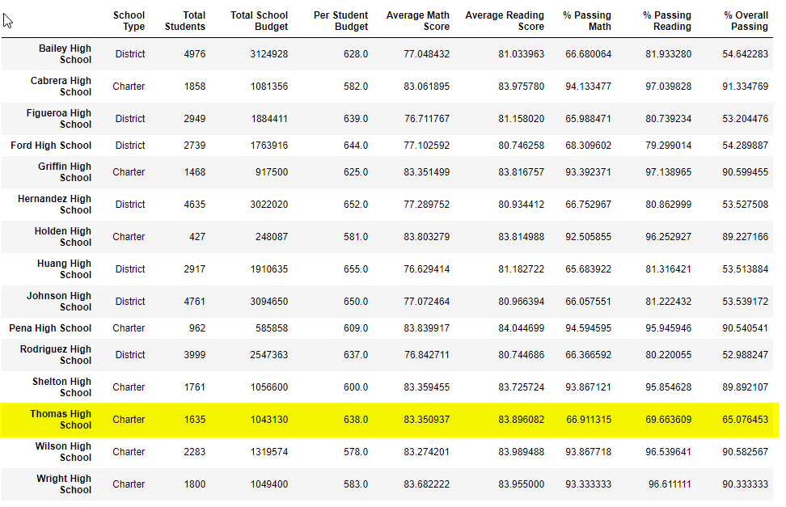

# School_District_Analysis

### Backgroud 

The grades of the ninth graders at Thomas High School have been changed.Therefore, we have to-

- Replace the ninth-grade math and reading scores from Thomas High School.
- Keep all other data associated with the ninth-grade students and Thomas High School intact.

### Redo the School District Data Analysis

- How is the district summary affected?
#### The district and school summary

Before Remove

After Remove

- The Average Math Score, % Passing Math, % Passing Reading, and % Overall Passing metrics of the district are descreased by 1%. and  Average Reading Scores do not any significant change.

The descreased numbers in metrics says that Thomas School 9th grade scores of Math and Reading are higher than the district average scores, and Average Reading Scores might be the same level or lower than the district level. 

However, the descrease is not large because the 9th grade students of Thomas school is small number to compare to the whole district students.
- The Total Schools, Total Students and Total Budget are not affected by the scores so they are the same

2- How is the school summary affected?

#### School Summary

Before Remove

After Remove

- The School Type, Total Students, Total School Budget, Per Student Budget are the same before and after because they are not affected by scores

3- How does replacing the ninth grader's math and reading scores affect Thomas High School's performance, relative to the other schools?

- Thomas school performance is in the second position of the top 5 performing schools before remove. However, Thomas school performance is not in the top 5 performing schools after remove. 
It says that Thomas High's 9th grade scores plays a significant role to place Thomas High in the top 5 performance school. 

